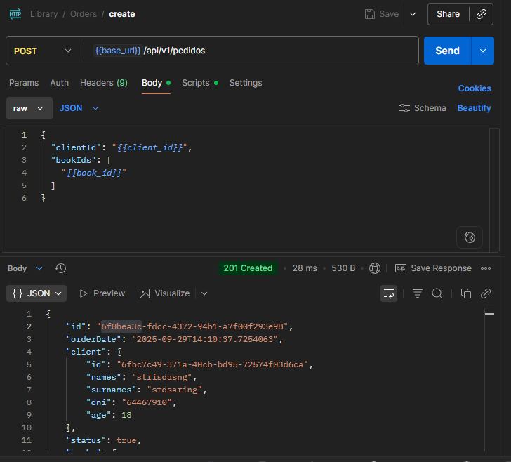
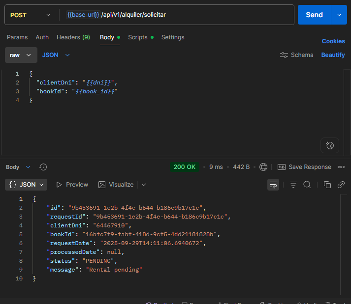
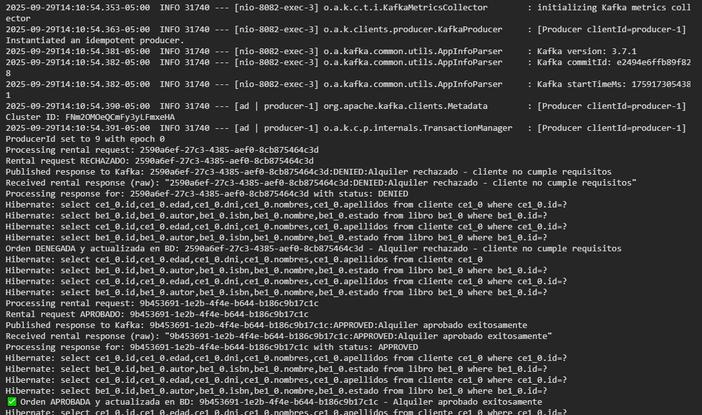

# Biblioteca Hexagonal

Sistema de gestión de biblioteca implementado con arquitectura hexagonal, Spring Boot, Kafka y MySQL.

## Descripción

Sistema que permite gestionar clientes, libros, pedidos y alquileres de manera asíncrona utilizando eventos de Kafka. Implementa los principios de arquitectura hexagonal con separación clara entre dominio, aplicación e infraestructura.

## Características

- ✅ Gestión de clientes, libros y pedidos
- ✅ Alquiler asíncrono con Kafka (2 topics: `alquiler-requests` y `alquiler-responses`)
- ✅ Consultas de libros alquilados por cliente
- ✅ Arquitectura hexagonal con puertos y adaptadores
- ✅ Soporte para JDBC y JPA
- ✅ Base de datos MySQL
- ✅ Documentación Swagger/OpenAPI

## Tecnologías

- **Java 17**
- **Spring Boot 3.3.2**
- **Apache Kafka 3.7**
- **MySQL 8**
- **Maven**
- **Docker & Docker Compose**

## Despliegue Local

### Prerrequisitos
- Java 17+
- Maven 3.6+
- Docker & Docker Compose

### 1. Clonar el repositorio
```bash
git clone <repository-url>
cd biblioteca-hexagonal
```

### 2. Levantar Kafka (solo infraestructura)
```bash
docker-compose -f docker-compose-kafka.yml up -d
```

### 3. Configurar base de datos MySQL local
Crear base de datos `biblioteca` en MySQL local.

### 4. Ejecutar la aplicación

#### Con perfil H2 (base de datos en memoria):
```bash
mvn spring-boot:run "-Dspring.profiles.active=h2"
```

#### Con perfil MySQL (base de datos externa):
```bash
mvn spring-boot:run "-Dspring.profiles.active=mysql"
```

#### Alternativamente usando variables de entorno:
```bash
# H2
set SPRING_PROFILES_ACTIVE=h2 && mvn spring-boot:run

# MySQL  
set SPRING_PROFILES_ACTIVE=mysql && mvn spring-boot:run
```

#### En Linux/Mac:
```bash
# H2
SPRING_PROFILES_ACTIVE=h2 mvn spring-boot:run

# MySQL
SPRING_PROFILES_ACTIVE=mysql mvn spring-boot:run
```

### 5. Acceder a los servicios
- **API**: http://localhost:8082
- **Swagger UI**: http://localhost:8082/swagger-ui.html
- **Kafdrop (Kafka UI)**: http://localhost:19000
- **H2 Console** (solo con perfil h2): http://localhost:8082/h2-console
  - JDBC URL: `jdbc:h2:mem:biblioteca`
  - Username: `sa`
  - Password: *(vacío)*

## Despliegue Global con Docker

### Levantar todo el stack (Kafka + MySQL + Aplicación)
```bash
docker-compose -f docker-compose-full.yml up -d
```

### Servicios disponibles
- **API**: http://localhost:8082
- **Swagger UI**: http://localhost:8082/swagger-ui.html
- **Kafdrop**: http://localhost:19000
- **MySQL**: localhost:3308

## Endpoints Principales

### Gestión de Clientes
- `GET /api/v1/clientes` - Listar clientes
- `POST /api/v1/clientes` - Crear cliente
- `GET /api/v1/clientes/{id}` - Obtener cliente
- `PUT /api/v1/clientes/{id}` - Actualizar cliente
- `DELETE /api/v1/clientes/{id}` - Eliminar cliente

### Gestión de Libros
- `GET /api/v1/libros` - Listar libros
- `POST /api/v1/libros` - Crear libro
- `GET /api/v1/libros/{id}` - Obtener libro
- `PUT /api/v1/libros/{id}` - Actualizar libro
- `DELETE /api/v1/libros/{id}` - Eliminar libro

### Alquiler Asíncrono (Kafka)
- `POST /api/v1/alquiler/solicitar` - Solicitar alquiler (publica a Kafka)
- `GET /api/v1/alquiler/estado/{requestId}` - Consultar estado de alquiler

### Consultas
- `GET /api/v1/consultas/libros-alquilados/cliente/{dni}` - Libros alquilados por cliente

## Configuración

### Perfiles disponibles
- **h2**: Base de datos H2 en memoria (ideal para desarrollo y pruebas)
- **mysql**: Base de datos MySQL (para producción)

### Comandos por perfil
```bash
# Ejecutar con H2 (Windows PowerShell)
mvn spring-boot:run "-Dspring.profiles.active=h2"

# Ejecutar con MySQL (Windows PowerShell)
mvn spring-boot:run "-Dspring.profiles.active=mysql"

# Con variables de entorno (Windows)
set SPRING_PROFILES_ACTIVE=h2 && mvn spring-boot:run
set SPRING_PROFILES_ACTIVE=mysql && mvn spring-boot:run

# Linux/Mac
SPRING_PROFILES_ACTIVE=h2 mvn spring-boot:run
SPRING_PROFILES_ACTIVE=mysql mvn spring-boot:run
```

### Variables de entorno
```bash
SPRING_PROFILES_ACTIVE=mysql
SPRING_DATASOURCE_URL=jdbc:mysql://localhost:3306/biblioteca
SPRING_DATASOURCE_USERNAME=root
SPRING_DATASOURCE_PASSWORD=password
KAFKA_BOOTSTRAP_SERVERS=localhost:9094
```

### Datos de prueba
El sistema incluye datos de prueba que se cargan automáticamente:
- **5 clientes** con diferentes DNIs y edades
- **8 libros** de literatura clásica y contemporánea
- **5 pedidos** con sus respectivos items
- Algunos libros marcados como no disponibles para probar el sistema

## Arquitectura

```
src/
├── main/java/com/example/bibliotecahex/
│   ├── domain/                 # Capa de dominio
│   │   ├── model/             # Entidades y VOs
│   │   └── port/              # Puertos (interfaces)
│   ├── application/           # Capa de aplicación
│   │   ├── usecases/          # Casos de uso
│   │   └── dto/               # DTOs de aplicación
│   └── infrastructure/        # Capa de infraestructura
│       ├── in/                # Adaptadores de entrada
│       │   ├── web/           # Controllers REST
│       │   └── messaging/     # Consumers Kafka
│       └── out/               # Adaptadores de salida
│           ├── persistence/   # Repositorios JDBC/JPA
│           └── messaging/     # Producers Kafka
```

## Desarrollo

### Compilar
```bash
mvn clean compile
```

### Ejecutar tests
```bash
mvn test
```

### Empaquetar
```bash
mvn clean package
```

### Detener servicios
```bash
# Solo Kafka
docker-compose -f docker-compose-kafka.yml down

# Stack completo
docker-compose -f docker-compose-full.yml down
```

## Evidencias de Funcionamiento

### 1. Alquiler Vía REST (Respuesta Inmediata)

Solicitud de alquiler síncrono mediante API REST que crea el pedido inmediatamente en la base de datos:



*Captura mostrando la respuesta inmediata del endpoint `/api/v1/alquiler/solicitar` con creación directa del pedido.*

### 2. Alquiler Vía Kafka (Eventos Asíncronos)

Procesamiento asíncrono de solicitudes de alquiler utilizando eventos de Kafka:



*Evidencia del flujo asíncrono donde la solicitud se procesa a través de eventos Kafka con respuesta diferida.*

### 3. Logs de Kafka - Flujo de Eventos

Trazabilidad completa del flujo de eventos en los topics de Kafka:



*Logs del sistema mostrando:*
- **Publicación de eventos** en topic `alquiler-requests`
- **Procesamiento de eventos** por el consumer 
- **Respuesta de eventos** en topic `alquiler-responses`
- **Actualización en base de datos** con estado final del alquiler

### Flujo Completo Evidenciado

1. ✅ **Petición HTTP** → Endpoint REST recibe solicitud
2. ✅ **Publicación Kafka** → Evento enviado a `alquiler-requests`
3. ✅ **Procesamiento** → Consumer procesa y aprueba/rechaza
4. ✅ **Respuesta Kafka** → Evento enviado a `alquiler-responses`
5. ✅ **Actualización BD** → Estado del pedido actualizado
6. ✅ **Trazabilidad** → Logs completos del flujo asíncrono

### Herramientas de Monitoreo

- **Kafdrop**: http://localhost:19000 para visualizar topics y mensajes
- **Swagger UI**: http://localhost:8082/swagger-ui.html para testing de APIs
- **H2 Console**: http://localhost:8082/h2-console para inspección de datos
