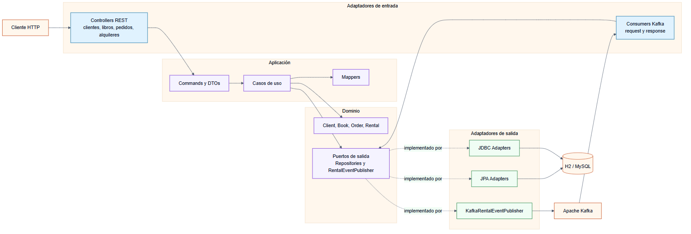
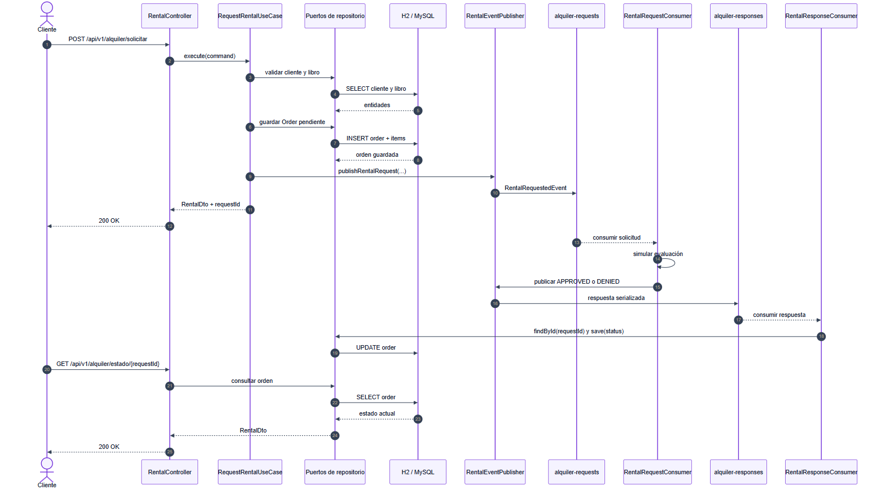

# Biblioteca Hexagonal

Backend para gestionar clientes, libros, pedidos y alquileres. El proyecto separa dominio, casos de uso y adaptadores mediante arquitectura hexagonal, y combina una API REST con un flujo asíncrono basado en Apache Kafka.

## Funcionalidades

- CRUD de clientes y libros.
- Creación y consulta de pedidos.
- Solicitud asíncrona de alquileres.
- Consulta del estado mediante un `requestId`.
- Consulta de libros alquilados por DNI del cliente.
- Puertos de persistencia con adaptadores JDBC y JPA.
- Perfiles H2 y MySQL, Swagger y despliegue con Docker Compose.

## Tecnologías

Java 17 · Spring Boot 3.3.2 · Spring Web · Spring Data JPA · JDBC · Apache Kafka 3.7 · H2 · MySQL 8 · Maven · Docker · OpenAPI/Swagger

## Arquitectura hexagonal



- **Dominio:** entidades y contratos de salida sin depender de controladores o bases de datos.
- **Aplicación:** commands, DTOs, mappers y casos de uso que coordinan las reglas.
- **Entrada:** controladores REST y consumidores Kafka.
- **Salida:** adaptadores JDBC/JPA y publicación de eventos Kafka.

### Flujo asíncrono de alquiler



La solicitud crea primero una orden pendiente y publica un evento en `alquiler-requests`. El consumidor simula una evaluación de aproximadamente dos segundos, publica `APPROVED` o `DENIED` en `alquiler-responses` y otro consumidor actualiza la orden. La implementación actual utiliza una decisión aleatoria con una probabilidad aproximada de aprobación del 70 %, por lo que este procesamiento representa una simulación de negocio.

## Endpoints

Base URL: `http://localhost:8082/api/v1`

### Clientes y libros

| Recurso | Operaciones |
| --- | --- |
| `/clientes` | `GET`, `POST` |
| `/clientes/{id}` | `GET`, `PUT`, `DELETE` |
| `/libros` | `GET`, `POST` |
| `/libros/{id}` | `GET`, `PUT`, `DELETE` |

### Pedidos, alquileres y consultas

| Método | Ruta | Descripción |
| --- | --- | --- |
| `POST` | `/pedidos` | Crear un pedido |
| `GET` | `/pedidos/{id}` | Consultar un pedido |
| `GET` | `/pedidos/cliente/dni/{dni}` | Consultar pedidos por cliente |
| `POST` | `/alquiler/solicitar` | Crear una solicitud y publicar el evento |
| `GET` | `/alquiler/estado/{requestId}` | Consultar el estado actual |
| `GET` | `/consultas/libros-alquilados/cliente/{dni}` | Consultar libros alquilados por DNI |

Swagger UI está disponible en `http://localhost:8082/swagger`.

## Ejecución local

Requisitos: JDK 17, Maven 3.6+ y Docker.

```bash
git clone https://github.com/AnthonyErazo/library-system-hex.git
cd library-system-hex
docker compose -f docker-compose-kafka.yml up -d
```

Para iniciar con H2 en memoria:

```bash
mvn spring-boot:run "-Dspring-boot.run.profiles=h2"
```

Para usar MySQL local, crea la base `biblioteca`, ajusta las credenciales de `application-mysql.yml` si es necesario y ejecuta:

```bash
mvn spring-boot:run "-Dspring-boot.run.profiles=mysql"
```

Servicios locales:

| Servicio | URL o conexión |
| --- | --- |
| API | `http://localhost:8082` |
| Swagger UI | `http://localhost:8082/swagger` |
| H2 Console | `http://localhost:8082/h2-console` |
| Kafdrop | `http://localhost:19000` |
| Kafka | `localhost:9094` |

H2 utiliza `jdbc:h2:mem:biblioteca`, usuario `sa` y contraseña vacía.

## Stack completo con Docker

```bash
docker compose -f docker-compose-full.yml up --build -d
```

Este entorno incluye la API, Kafka, Kafdrop y MySQL. MySQL se publica en el puerto local `3308`; dentro de la red Docker se utiliza `mysql:3306`.

Para detener los servicios:

```bash
docker compose -f docker-compose-full.yml down
```

## Estructura principal

```text
src/main/java/com/example/bibliotecahex/
├── domain/
│   ├── model/                 # Entidades, enums y excepciones
│   └── port/out/persistent/   # Contratos de persistencia y eventos
├── application/
│   ├── command/               # Datos de entrada de los casos de uso
│   ├── dto/                   # Resultados de aplicación
│   ├── mapper/                # Conversión dominio/DTO
│   └── usecases/              # Casos de uso por recurso
└── infrastructure/
    ├── in/web/                # Controllers, requests, responses y services
    ├── in/messaging/          # Configuración, consumers y producer Kafka
    └── out/persistence/       # Adaptadores y repositorios JDBC/JPA
```

## Verificación y compilación

```bash
mvn test
mvn clean package
```

Actualmente el repositorio no contiene casos automatizados en `src/test`; `mvn test` valida la compilación y el ciclo de Maven. Añadir pruebas unitarias de casos de uso y pruebas de integración para los adaptadores sería la siguiente mejora recomendada.

## Evidencias

### Solicitud REST


### Procesamiento asíncrono


### Trazabilidad en Kafka


---

Última actualización del proyecto: **29 de septiembre de 2025**.
